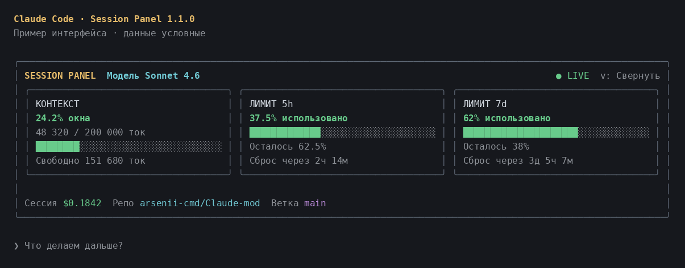
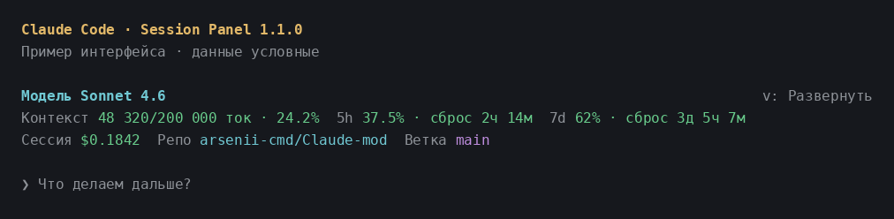

# Session Panel — мод для Claude Code

Панель над полем ввода с текущей моделью, контекстом, лимитами аккаунта и состоянием рабочего репозитория. Работает через официальный API **mods**, в терминале и во вкладке Code приложения Claude Desktop.

В **версии 1.1.0** — карточки с индикаторами заполнения, подробности по нажатию и компактный режим.





Превью отрисованы из исходников мода через Ink; данные на изображениях условные.

## Управление и раскладка

- **Свернуть / Развернуть** переключает карточки и компактную строку показателей. В терминале можно нажать `v`, когда панель имеет фокус: `Ctrl+X`, затем `Tab`. `Esc` возвращает фокус полю ввода.
- Нажатие на **заголовок карточки** открывает подробности; повторное нажатие или **Закрыть** убирает их. Контекст показывает локальную разбивку по категориям, лимиты — точную дату сброса в часовом поясе компьютера.
- В широком окне три карточки стоят рядом. При уменьшении ширины контекст занимает отдельную строку, затем все карточки располагаются вертикально.
- При первом показе мод выбирает компактный вид, если выделенной высоты недостаточно. Карточки можно развернуть вручную; высокую панель прокручивает Claude Code.
- Выбранный вид сохраняется при перерисовках, `/clear` и `/resume`. После перезапуска Claude Code выбор снова автоматический.

Стоимость, репозиторий и ветка находятся в нижней строке обоих режимов. В терминале `Ctrl+X`, затем `Ctrl+A` сворачивает всю полосу над промптом штатным средством Claude Code.

## Что показывает

| Показатель | Значение |
| --- | --- |
| Модель | Текущая модель основного диалога; обновляется после `/model`. |
| Контекст | Число входных токенов последнего ответа, размер окна и процент заполнения. Включает обычные, записанные в кеш и прочитанные из кеша токены. В карточке также показано свободное место. |
| 5h | Процент **использованного** лимита за пять часов и время до сброса. В карточке также показан оставшийся процент. |
| 7d | Процент **использованного** общего недельного лимита и время до сброса. В карточке также показан оставшийся процент. |
| Сессия | Стоимость текущей сессии в USD по учёту Claude Code, как в `/cost`. Для подписки это оценка стоимости запросов, а не дополнительное списание с карты. |
| Репо | `owner/repository` из Git remote `origin`; без remote — имя локального репозитория. За пределами Git показывает рабочую папку. |
| Ветка | Ветка текущей рабочей копии, включая Git worktree; при detached HEAD — `detached@<sha>`. |

Заполнение ниже 70% зелёное, от 70% — жёлтое, от 90% — красное. Длинные названия и показатели переносятся по ширине панели. Заголовок сокращает стандартные имена моделей, например `claude-sonnet-4-6` → `Sonnet 4.6`; полное имя доступно в подробностях контекста.

## Установка

Нужен **Claude Code 2.1.287 или новее** с включёнными модами. Проверьте версию командой `claude --version`. Git нужен для отображения ветки.

Внутри Claude Code:

```text
/plugin marketplace add arsenii-cmd/Claude-mod
/plugin install session-panel@arsenii-mods
/reload-plugins
```

Или из терминала:

```sh
claude plugin marketplace add arsenii-cmd/Claude-mod
claude plugin install session-panel@arsenii-mods
```

После установки запустите новую сессию или выполните `/reload-plugins` в открытой. Панель появляется автоматически.

Для разработки или разового запуска из клона:

```sh
git clone https://github.com/arsenii-cmd/Claude-mod.git
claude --plugin-dir ./Claude-mod
```

`--plugin-dir` загружает мод на одну сессию и поддерживает автоматическую перезагрузку при сохранении файлов. Для запуска в другом рабочем проекте укажите абсолютный путь к клону.

## Откуда берутся данные

Модель, контекст, стоимость и лимиты читаются из `$.session.model()` и `$.session.usage()`; это те же показания, которыми располагает Claude Code. Мод не делает запросов к модели или API аккаунта, не читает токены авторизации и не расходует токены на обновление панели. Подробности контекста запрашивают только локальную оценку `$.session.usage({ breakdown: "summary" })`; платный подсчёт токенов `full` не используется.

Контекст и лимиты отражают последнюю доступную оценку движка. В новой сессии, после компактизации или до первого ответа число токенов и процент могут быть неизвестны. Лимиты `five_hour` и `seven_day` могут отсутствовать при API-оплате, у стороннего провайдера или до получения первых показаний. Неизвестные значения показываются как **`—`**, а не как ноль. Лимиты относятся ко всему аккаунту, стоимость — к текущей сессии. После достижения даты сброса надпись становится `сброс сейчас`; процент обновляется по новым данным движка.

Панель перерисовывается при новых измерениях, завершении основного хода, выполнении команды и каждые 15 секунд. На перерисовке показания читаются заново. Git-данные кешируются на 15 секунд и обновляются после команд и основных ходов. Ветка определяется в **текущей рабочей папке**, поэтому отдельные worktree показывают свою ветку.

Мод сохраняет панели других модов в `AbovePrompt` и уступает место встроенному опросу. В VS Code chat, `claude -p` и облачных сессиях графическая панель не отображается: это ограничение поверхностей mods API.

## Проверка и разработка

Сборка и установка npm-зависимостей для работы мода не нужны. Исходники — ES-модули, которые Claude Code загружает напрямую. Для локальных тестов нужен Node.js 20+:

```sh
npm test
npm run check
```

24 Node.js-теста проверяют расчёты, неизвестные значения, раскладку, переключение режимов, открытие подробностей, сохранение интерфейса других модов, обновление данных, кеширование Git, жизненный цикл таймера и реальные Git worktree/detached HEAD во временном репозитории.

С установленным Claude Code доступны штатный валидатор и тесты UI:

```sh
claude plugin validate .
claude plugin test .
claude --plugin-dir .
```

Проверено на **Claude Code 2.1.289**: валидатор прошёл без предупреждений, два штатных теста проверили дерево UI и обработчики кнопок для terminal/Desktop, в том числе локальную разбивку контекста. Node.js-тесты и проверка синтаксиса также проходят. Ручная проверка отображения в авторизованной сессии терминала и Claude Desktop не выполнялась.

Документация API:

- [Обзор модов](https://code.claude.com/docs/en/plugins/mods/overview)
- [Создание и проверка мода](https://code.claude.com/docs/en/plugins/mods/create)
- [Штатные тесты модов](https://code.claude.com/docs/en/plugins/mods/test)
- [Справочник событий, методов и элементов](https://code.claude.com/docs/en/plugins/mods/reference)
- [Опубликованные TypeScript-типы](https://github.com/anthropics/claude-code/blob/main/mods/types/claude-code.d.ts)

## Обновление и удаление

```sh
claude plugin marketplace update arsenii-mods
claude plugin update session-panel@arsenii-mods
claude plugin uninstall session-panel@arsenii-mods
```

После обновления выполните `/reload-plugins` или начните новую сессию. Для отключения без удаления используйте `claude plugin disable session-panel@arsenii-mods`.

## Авторы и контрибьюторы

- [arsenii-cmd](https://github.com/arsenii-cmd) — автор проекта и требований.
- [OpenAI Codex](https://openai.com/codex/) — разработка мода, тесты и документация.

## Лицензия

[MIT](LICENSE): свободное использование, изменение и распространение, в том числе в коммерческих проектах, с сохранением текста лицензии и уведомления об авторстве.
